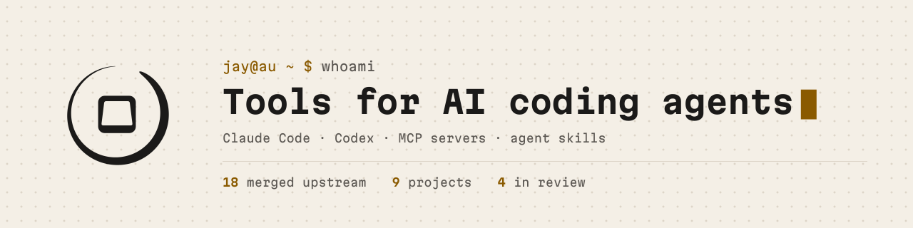
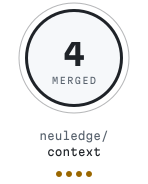
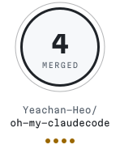
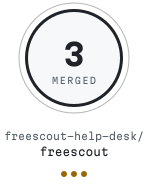
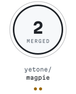
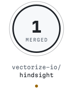
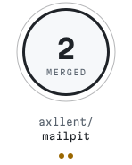
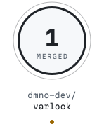
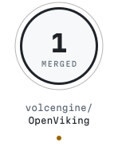

<!-- generated:banner -->
<picture><source media="(prefers-color-scheme: dark)" srcset="generated/banner-dark.svg"></picture>
<!-- /generated:banner -->

I build small tools for AI coding agents: Claude Code, Codex, MCP servers and agent skills.

By day I look after systems and infrastructure, and manage open source projects, for a not-for-profit in Australia. Everything here is personal work.

## Start here

- [ai-quota-meter](https://github.com/sigiletlabs/ai-quota-meter): shows your remaining Claude Code quota on the status line, using Anthropic's own numbers, and switches on Codex's built-in quota display. A single static binary with no network access.

New tools are released under [Sigilet Labs](https://github.com/sigiletlabs).

## Merged upstream

Fixes merged into other people's projects. One dot per merged pull request.

<!-- generated:stamps -->
<a href="https://github.com/neuledge/context/pulls?q=is%3Apr%20author%3AJayOfTheKeyboard%20is%3Amerged"><picture><source media="(prefers-color-scheme: dark)" srcset="generated/stamps/neuledge-context-dark.svg"></picture></a>
<a href="https://github.com/Yeachan-Heo/oh-my-claudecode/pulls?q=is%3Apr%20author%3AJayOfTheKeyboard%20is%3Amerged"><picture><source media="(prefers-color-scheme: dark)" srcset="generated/stamps/yeachan-heo-oh-my-claudecode-dark.svg"></picture></a>
<a href="https://github.com/freescout-help-desk/freescout/pulls?q=is%3Apr%20author%3AJayOfTheKeyboard%20is%3Amerged"><picture><source media="(prefers-color-scheme: dark)" srcset="generated/stamps/freescout-help-desk-freescout-dark.svg"></picture></a>
<a href="https://github.com/yetone/magpie/pulls?q=is%3Apr%20author%3AJayOfTheKeyboard%20is%3Amerged"><picture><source media="(prefers-color-scheme: dark)" srcset="generated/stamps/yetone-magpie-dark.svg"></picture></a>
<a href="https://github.com/vectorize-io/hindsight/pulls?q=is%3Apr%20author%3AJayOfTheKeyboard%20is%3Amerged"><picture><source media="(prefers-color-scheme: dark)" srcset="generated/stamps/vectorize-io-hindsight-dark.svg"></picture></a>
<a href="https://github.com/axllent/mailpit/pulls?q=is%3Apr%20author%3AJayOfTheKeyboard%20is%3Amerged"><picture><source media="(prefers-color-scheme: dark)" srcset="generated/stamps/axllent-mailpit-dark.svg"></picture></a>
<a href="https://github.com/dmno-dev/varlock/pulls?q=is%3Apr%20author%3AJayOfTheKeyboard%20is%3Amerged"><picture><source media="(prefers-color-scheme: dark)" srcset="generated/stamps/dmno-dev-varlock-dark.svg"></picture></a>
<a href="https://github.com/microsoft/SkillOpt/pulls?q=is%3Apr%20author%3AJayOfTheKeyboard%20is%3Amerged"><picture><source media="(prefers-color-scheme: dark)" srcset="generated/stamps/microsoft-skillopt-dark.svg"></picture></a>
<a href="https://github.com/NVIDIA/SkillEvaluator/pulls?q=is%3Apr%20author%3AJayOfTheKeyboard%20is%3Amerged"><picture><source media="(prefers-color-scheme: dark)" srcset="generated/stamps/nvidia-skillevaluator-dark.svg"></picture></a>
<a href="https://github.com/microsoft/conductor/pulls?q=is%3Apr%20author%3AJayOfTheKeyboard%20is%3Amerged"><picture><source media="(prefers-color-scheme: dark)" srcset="generated/stamps/microsoft-conductor-dark.svg"></picture></a>
<a href="https://github.com/volcengine/OpenViking/pulls?q=is%3Apr%20author%3AJayOfTheKeyboard%20is%3Amerged"><picture><source media="(prefers-color-scheme: dark)" srcset="generated/stamps/volcengine-openviking-dark.svg"></picture></a>
<!-- /generated:stamps -->

Every merged pull request, one line each

- [neuledge/context#125](https://github.com/neuledge/context/pull/125): only skip repo-meta filenames at the scan root
- [neuledge/context#126](https://github.com/neuledge/context/pull/126): Go module support for the docs registry
- [neuledge/context#166](https://github.com/neuledge/context/pull/166): skip test and example directories only at the repo root
- [neuledge/context#173](https://github.com/neuledge/context/pull/173): generic types and JSX inside code examples stay in the docs index
- [neuledge/context#175](https://github.com/neuledge/context/pull/175): section titles keep words inside bold, italics, links and code, so Python doc sections stop being indexed as "Introduction"
- [yetone/magpie#88](https://github.com/yetone/magpie/pull/88): the gateway reports a Claude reply cut off by the context window as cut off
- [yetone/magpie#128](https://github.com/yetone/magpie/pull/128): gateway ids made in the same clock tick stay unique
- [Yeachan-Heo/oh-my-claudecode#4152](https://github.com/Yeachan-Heo/oh-my-claudecode/pull/4152): the git guardrail hook also catches `git --no-pager push` and other global options
- [Yeachan-Heo/oh-my-claudecode#4160](https://github.com/Yeachan-Heo/oh-my-claudecode/pull/4160): the code-simplifier hook reads the global config from `~/.config` on Linux, where the docs put it
- [Yeachan-Heo/oh-my-claudecode#4161](https://github.com/Yeachan-Heo/oh-my-claudecode/pull/4161): Copilot and Cursor rule globs like `**/*.py` also match files at the top level
- [Yeachan-Heo/oh-my-claudecode#4177](https://github.com/Yeachan-Heo/oh-my-claudecode/pull/4177): the directory-context hook stops adding a sibling folder's README and AGENTS.md
- [microsoft/conductor#572](https://github.com/microsoft/conductor/pull/572): a `$` before a `{{ }}` expression no longer stops a workflow loading
- [volcengine/OpenViking#5448](https://github.com/volcengine/OpenViking/pull/5448): `ovcli.conf` accepts the `oidc_token` and trusted-mode settings the Rust CLI already reads
- [NVIDIA/SkillEvaluator#168](https://github.com/NVIDIA/SkillEvaluator/pull/168): the PII scan stops reporting Chrome User-Agent versions as IP addresses
- [freescout-help-desk/freescout#5683](https://github.com/freescout-help-desk/freescout/pull/5683): toolbar icons, stars and menu toggles can be reached with Tab and pressed with Enter or Space
- [microsoft/SkillOpt#295](https://github.com/microsoft/SkillOpt/pull/295): the sleep harvester stops reading skill text Claude Code injects as things the user typed
- [dmno-dev/varlock#1169](https://github.com/dmno-dev/varlock/pull/1169): the standalone binary can start its encryption helper when run from a directory the user cannot enter, so `varlock cache clear` works for service users
- [freescout-help-desk/freescout#5692](https://github.com/freescout-help-desk/freescout/pull/5692): confirmation dialogs focus the primary button, so Enter confirms
- [freescout-help-desk/freescout#5693](https://github.com/freescout-help-desk/freescout/pull/5693): deleting a conversation opens the next active one when that is the after-send setting, as a status change already does
- [vectorize-io/hindsight#4870](https://github.com/vectorize-io/hindsight/pull/4870): the MCP `recall` docs say what `max_tokens` counts
- [axllent/mailpit#742](https://github.com/axllent/mailpit/pull/742): `_` and `%` in a search match themselves instead of acting as wildcards

## In review

- [stripe/link-cli#370](https://github.com/stripe/link-cli/pull/370): `--auth` without a path is refused instead of logging out the default session
- [ahmad-a0/silverbullet-mcp#19](https://github.com/ahmad-a0/silverbullet-mcp/pull/19): the note-editing tools only write `.md` notes
- [zvec-ai/zvec-grep#229](https://github.com/zvec-ai/zvec-grep/pull/229): managed `rg` searches keep their globs and ignore rules when the search path starts with `.`
- [holepunchto/dht-rpc#133](https://github.com/holepunchto/dht-rpc/pull/133): closing a session releases each of its requests from the congestion window once, not twice

Issues filed: [SkillSpector#638](https://github.com/NVIDIA/SkillSpector/issues/638), [#639](https://github.com/NVIDIA/SkillSpector/issues/639), [#640](https://github.com/NVIDIA/SkillSpector/issues/640), [SkillEvaluator#167](https://github.com/NVIDIA/SkillEvaluator/issues/167), [silverbullet-mcp#20](https://github.com/ahmad-a0/silverbullet-mcp/issues/20), [chrome-agent#12](https://github.com/captivus/chrome-agent/issues/12).
